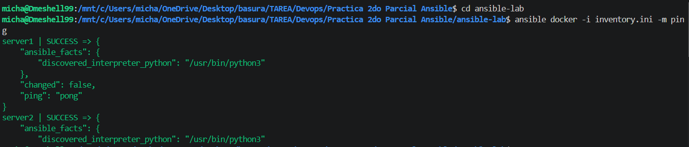
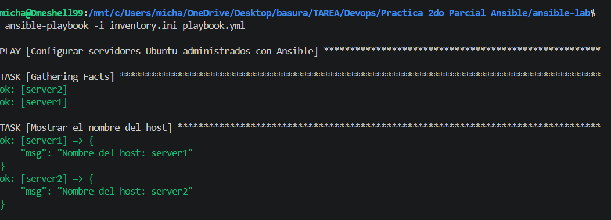
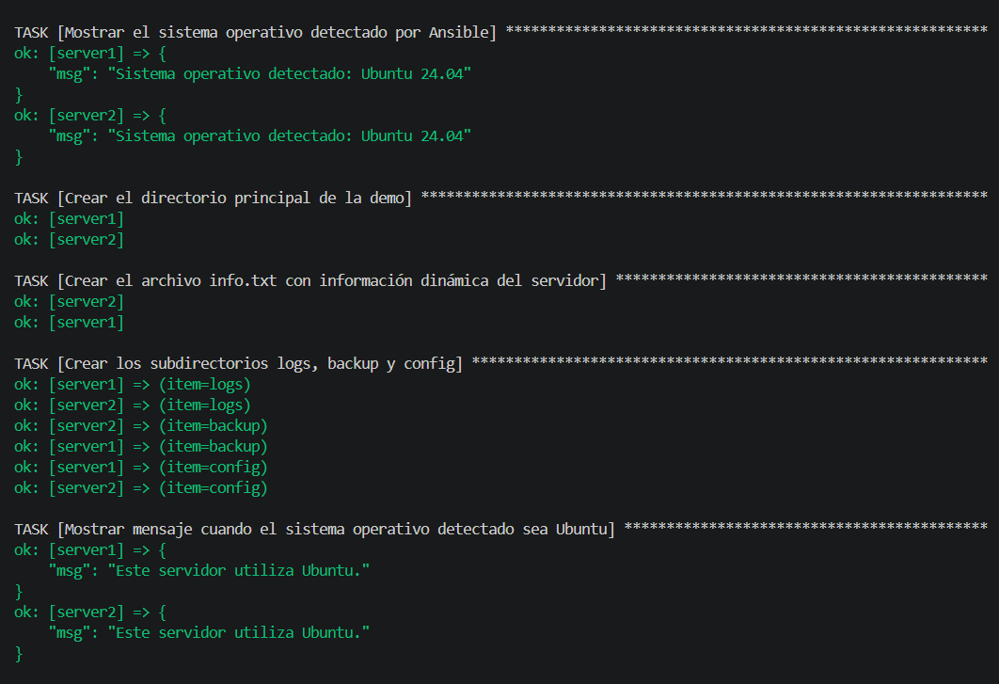
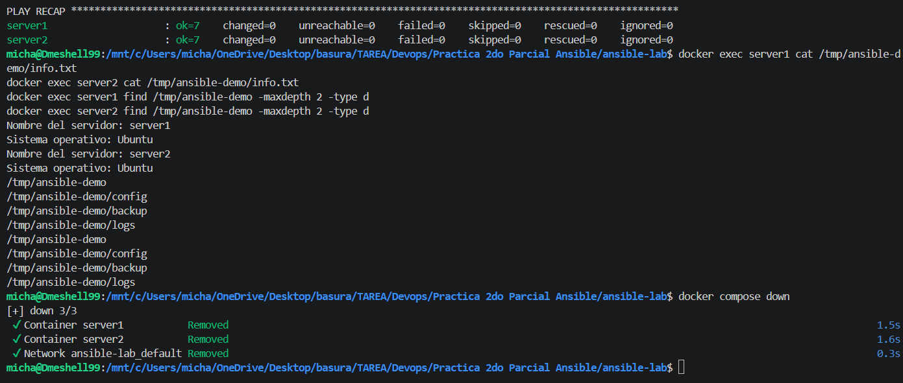

# Laboratorio de Docker y Ansible

## Objetivo de la práctica

Este proyecto crea dos servidores Ubuntu (`server1` y `server2`) mediante Docker y los administra con Ansible, utilizando la conexión directa de Docker (`ansible_connection=docker`). A través de un playbook, Ansible recopila información de cada servidor (nombre de host y sistema operativo), crea directorios, genera un archivo de información con datos dinámicos y crea una serie de subdirectorios mediante un loop, demostrando el uso de facts, condicionales, loops y módulos nativos de Ansible.

## Requisitos previos

* Docker.
* Docker Compose.
* Ansible.
* Python 3.
* La colección `community.docker`, requerida para utilizar la conexión de Docker con Ansible.

Instalación de la colección requerida:

```bash
ansible-galaxy collection install community.docker
```

## Estructura del proyecto

```text
ansible-lab/
├── docker-compose.yml
├── inventory.ini
├── playbook.yml
├── README.md
└── img/
    ├── 01-ansible-ping.png
    ├── 02-playbook-run-parte1.png
    ├── 03-playbook-run-parte2.png
    └── 04-play-recap-verificacion-y-cierre.png
```

## Iniciar los contenedores

Desde la carpeta `ansible-lab`, ejecuta:

```bash
docker compose up -d
```

## Verificar los contenedores

```bash
docker ps
```

## Instalar Python en `server1`

```bash
docker exec -it server1 bash
apt update
apt install -y python3
exit
```

## Instalar Python en `server2`

```bash
docker exec -it server2 bash
apt update
apt install -y python3
exit
```

Alternativa no interactiva (ejecutable directamente desde la terminal, sin entrar a cada contenedor):

```bash
docker exec server1 bash -c "apt update && apt install -y python3"
docker exec server2 bash -c "apt update && apt install -y python3"
```

## Comprobar la conexión de Ansible

```bash
ansible docker -i inventory.ini -m ping
```

## Ejecutar el playbook

```bash
ansible-playbook -i inventory.ini playbook.yml
```

## Verificar los resultados

```bash
docker exec server1 cat /tmp/ansible-demo/info.txt
docker exec server2 cat /tmp/ansible-demo/info.txt
docker exec server1 find /tmp/ansible-demo -maxdepth 2 -type d
docker exec server2 find /tmp/ansible-demo -maxdepth 2 -type d
```

## Detener el laboratorio

```bash
docker compose down
```

## Evidencia de ejecución

**Comprobación de conectividad con Ansible (`ping`):**



**Ejecución del playbook — recopilación de facts y nombre del host:**



**Ejecución del playbook — sistema operativo, directorios, archivo info.txt, loop de subdirectorios y mensaje condicional de Ubuntu:**



**Resultado final (`PLAY RECAP` con `changed=0`, evidencia de idempotencia), verificación del contenido creado en ambos servidores y cierre del laboratorio:**


